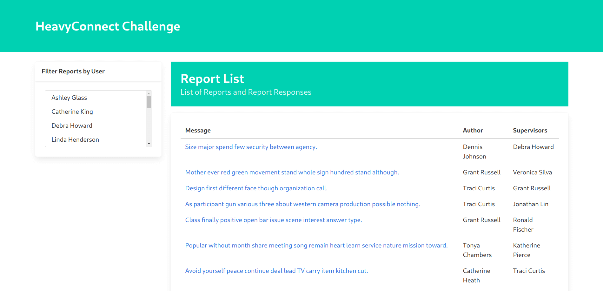
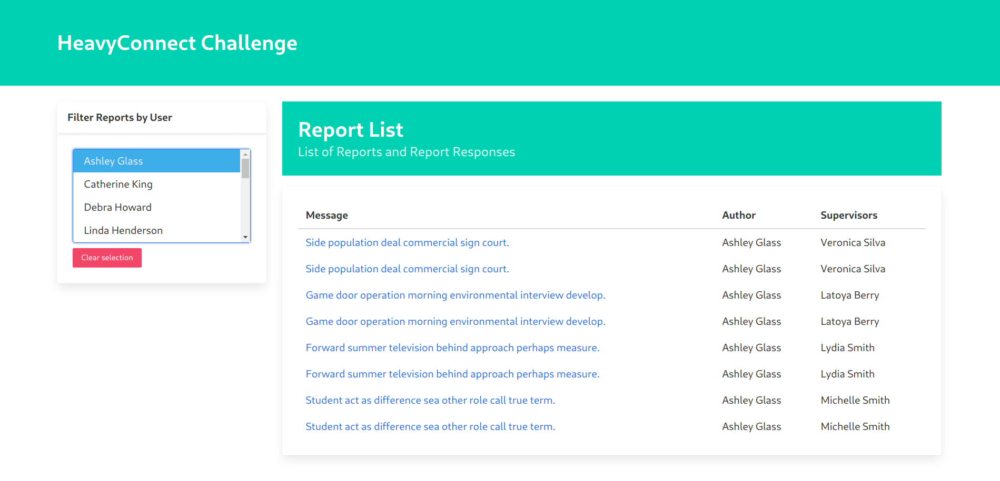

# 🍃 Reports Connect

A simple reports management application build for Heavy Connect challenge.

|                                          |                                                 |                                            |
| :--------------------------------------- | :---------------------------------------------: | :----------------------------------------: |
|  |  |  |
|                                          |                                                 |                                            |

## Getting Started

Create a virtual environment and install the dependencies:

```sh
pipenv install # recommended
pipenv shell

# or

python -m venv venv
source venv/bin/activate

pip install -r requirements.txt
```

Initialize the database and load the fixtures:

```sh
python manage.py migrate

# load fixtures
python manage.py loaddata fixtures/users.json --app users.User
python manage.py loaddata fixtures/reports.json --app reports.Report
python manage.py loaddata fixtures/report_responses.json --app reports.ReportResponse
```

Generate the static files:

```sh
python manage.py collectstatic
python manage.py compress
```

Now, just run the server:

```sh
python manage.py runserver
```

## Usage

To use application, just navigate to http://127.0.0.1:8000/.

## API

The API have two endpoints: _/reports_ and _/users_ (bonus).

### Reports:

http://127.0.0.1:8000/reports/

That will returns:

```json
{
  "count": 100,
  "next": null,
  "previous": null,
  "results": [
    {
      "message": "Size major spend few security between agency.",
      "author": {
        "first_name": "Dennis",
        "last_name": "Johnson",
        "email": "karen57@mcmahon.com"
      },
      "supervisors": [
        {
          "first_name": "Debra",
          "last_name": "Howard",
          "email": "smithcarol@hotmail.com"
        }
      ],
      "responses": [
        {
          "message": "Bank according style seek forward difficult follow learn us around serious.",
          "author": {
            "first_name": "Debra",
            "last_name": "Howard",
            "email": "smithcarol@hotmail.com"
          }
        },
        {
          "message": "Church executive none relationship positive add see.",
          "author": {
            "first_name": "Debra",
            "last_name": "Howard",
            "email": "smithcarol@hotmail.com"
          }
        }
      ]
    }
    // ...
  ]
}
```

You can also filter reports of a specific user or supervisor:

```
/results/?user_id=id
```

And for pagination, use the offset and limit query strings:

```
/results/?offset={offset}&limit={limit}
```

### Users:

http://127.0.0.1:8000/users/

That will returns:

```json
{
  "count": 20,
  "next": null,
  "previous": null,
  "results": [
    {
      "id": 2,
      "first_name": "Ashley",
      "last_name": "Glass",
      "email": "jonathan48@yahoo.com"
    },
    // ...
    {
      "id": 21,
      "first_name": "Ryan",
      "last_name": "Brown",
      "email": "michaelthomas@yahoo.com"
    }
  ]
}
```

## License

This project in under the MIT License. See [LICENSE](./LICENSE) for more information.
